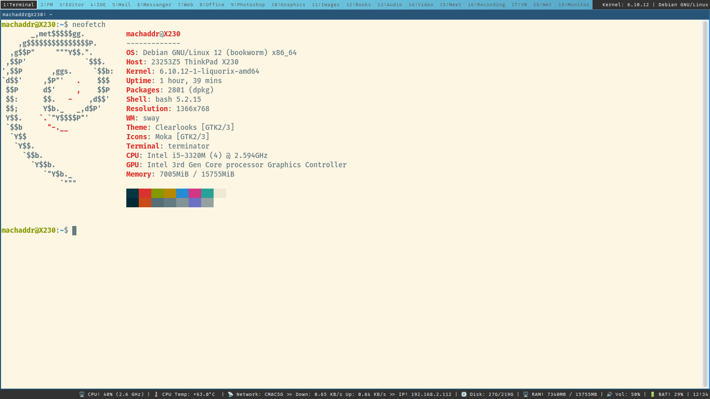

# Debian Sway Laptop Configuration



This repository contains the configuration files and instructions to set up a **Debian-based Linux distribution** with **Sway** as the window manager, optimized for laptops. It is designed to provide a minimalist, yet efficient, environment for users who prefer a tiling window manager on a lightweight, customized system.

## Table of Contents
- [Features](#features)
- [Prerequisites](#prerequisites)
- [Installation](#installation)
- [Additional Packages](#additional-packages)
- [Configuration Details](#configuration-details)
- [Contributing](#contributing)
- [License](#license)

## Features
- **Sway window manager**: Tiling window manager for Wayland.
- **Optimized for laptop use**: Custom key bindings, power management, and performance tweaks.
- **Lightweight and fast**: Minimal overhead with only essential applications and services.
- **Modular and extensible**: Easily add or modify components as needed.

## Prerequisites
Ensure you have a **Debian-based system** installed. You can use **Debian**, **Ubuntu**, or other derivatives.

### Required Dependencies:
Before proceeding with the installation, install these packages:
```bash
sudo apt update && sudo apt install -y \
  sway* \
  wayland* \
  light \
  libnotify-bin \
  grim \
  slurp \
  wofi \
  pulseaudio-utils \
  pipewire \
  procps \
  lm-sensors \
  ifstat \
  wireless-tools \
  upower \
  net-tools
```

## Additional Packages
For a more comprehensive setup, consider installing these additional packages:
```bash
sudo apt install -y \
  terminator \
  nemo \
  subl \
  code \
  thunderbird \
  polari \
  firefox \
  libreoffice \
  gimp \
  blender \
  eom \
  atril \
  spotify \
  vlc \
  zoom \
  ardour \
  virtualbox \
  network-manager-gnome
```

These packages will provide you with a more complete desktop environment, including a file manager, terminal emulator, and additional system utilities.

## Installation
Clone this repository to your local machine:
```bash
git clone https://github.com/machaddr/Debian-Sway-Laptop-Configuration.git
cd Debian-Sway-Laptop-Configuration
```

Move the configuration files to their respective directories:
```bash
cp -r * /etc/sway/
```

Ensure Sway and all necessary components are set up properly, then log out and log back in to start using Sway.

## Configuration Details
The configuration files include:
- **Sway** settings: Custom keybindings, layouts, and window management tweaks.
- **Wofi**: Application launcher for Wayland.

You can customize the key bindings, appearance, and behavior to suit your preferences.

## Contributing
Contributions are welcome! If you'd like to contribute to this project, please fork the repository and create a pull request with your changes.

## License
This project is licensed under the MIT License. See the [LICENSE](./LICENSE) file for details.
